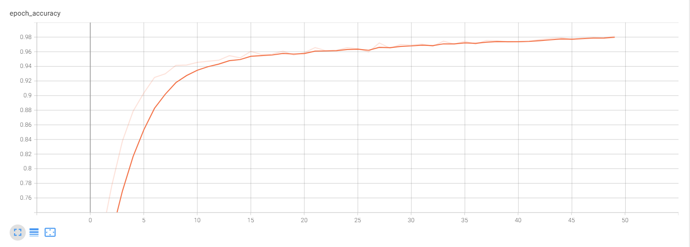
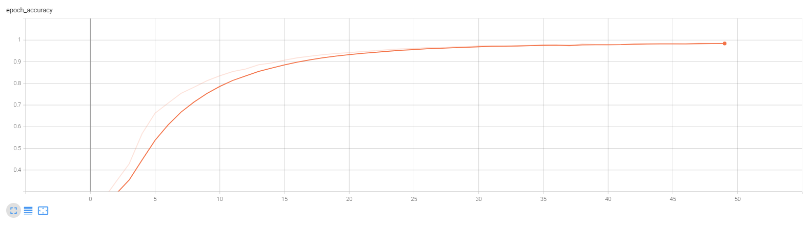

# CIFAR-10 TensorFlow Models (32x32)


## Overview

This repository is an early TensorFlow image-classification project for CIFAR-10. It contains two training pipelines: a custom CNN and a VGG19-style network.

## Preview

| Custom CNN | VGG19-style |
| --- | --- |
|  |  |

## Highlights

- two baseline image-classification pipelines in one repository
- custom CNN and VGG19-style model comparison
- saved training curves for quick portfolio preview

## Project Structure

- `train_net.py`: train the custom CNN
- `train_vgg19.py`: train the VGG19-style model
- `test_net.py`: run inference with the custom CNN
- `test_vgg19.py`: run inference with the VGG19-style model
- `models/`: model definitions
- `figures/`: saved training curves

## Setup

```bash
pip install -r requirements.txt
```

## Usage

Train the custom CNN:

```bash
python train_net.py
```

Train the VGG19-style model:

```bash
python train_vgg19.py
```

Run prediction:

```bash
python test_net.py --weights log-self/self.h5 --image-dir images
python test_vgg19.py --weights log-vgg19/vgg19.h5 --image-dir images
```

## Notes

- Trained `.h5` weights are not included.
- CIFAR-10 is loaded through `tensorflow.keras.datasets.cifar10`.
